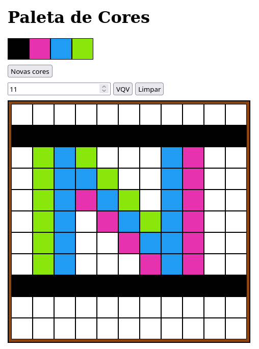

# Projeto Trybe - Pixels Art

Neste projeto a proposta era criar um _paint_ com HTML, CSS e JS. Além da funcionalidade da pintura em si, desenvolvi um botão que gerava cores aleatórias um input numérico para ajustar o tamanho da tela com o botão de confirmar e outro para limpar a tela.

#### Habilidades desenvolvidas no projeto: 
- Manipular o DOM
- Manipular o Javascript

#### Print da aplicação:

